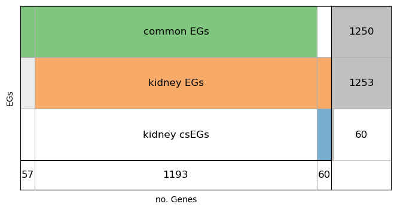
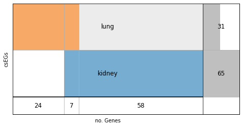

1. Install HELP from GitHub
~~~~~~~~~~~~~~~~~~~~~~~~~~~

Skip this cell if you alread have installed HELP.

.. code:: ipython3

    !pip install git+https://github.com/giordamaug/HELP.git

2. Download the input files
~~~~~~~~~~~~~~~~~~~~~~~~~~~

Download from the DepMap portal the gene deletion expression scores
(``CRISPRGeneEffect.csv``) and the map between cell-lines and tissues
(``Model.csv``). Skip this step if you already have these input files
locally.

.. code:: ipython3

    !wget -c https://figshare.com/ndownloader/files/43346616 -O CRISPRGeneEffect.csv
    !wget -c https://figshare.com/ndownloader/files/43746708 -O Model.csv

3. Load the input file
~~~~~~~~~~~~~~~~~~~~~~

Load the CRISPR data and show the content.

.. code:: ipython3

    import pandas as pd
    import os
    df_orig = pd.read_csv("CRISPRGeneEffect.csv").rename(columns={'Unnamed: 0': 'gene'}).rename(columns=lambda x: x.split(' ')[0]).set_index('gene').T
    print(f'{df_orig.isna().sum().sum()} NaNs over {len(df_orig)*len(df_orig.columns)} values')
    df_orig

.. parsed-literal::

    739493 NaNs over 20287300 values

.. raw:: html

    

    
    <table border="1" class="dataframe">
      <thead>
        <tr style="text-align: right;">
          <th>gene</th>
          <th>ACH-000001</th>
          <th>ACH-000004</th>
          <th>ACH-000005</th>
          <th>ACH-000007</th>
          <th>ACH-000009</th>
          <th>...</th>
          <th>ACH-002834</th>
          <th>ACH-002847</th>
          <th>ACH-002922</th>
          <th>ACH-002925</th>
          <th>ACH-002926</th>
        </tr>
      </thead>
      <tbody>
        <tr>
          <th>A1BG</th>
          <td>-0.122637</td>
          <td>0.019756</td>
          <td>-0.107208</td>
          <td>-0.031027</td>
          <td>0.008888</td>
          <td>...</td>
          <td>-0.055721</td>
          <td>-0.009973</td>
          <td>-0.025991</td>
          <td>-0.127639</td>
          <td>-0.068666</td>
        </tr>
        <tr>
          <th>A1CF</th>
          <td>0.025881</td>
          <td>-0.083640</td>
          <td>-0.023211</td>
          <td>-0.137850</td>
          <td>-0.146566</td>
          <td>...</td>
          <td>-0.121228</td>
          <td>-0.119813</td>
          <td>-0.007706</td>
          <td>-0.040705</td>
          <td>-0.107530</td>
        </tr>
        <tr>
          <th>A2M</th>
          <td>0.034217</td>
          <td>-0.060118</td>
          <td>0.200204</td>
          <td>0.067704</td>
          <td>0.084471</td>
          <td>...</td>
          <td>0.072790</td>
          <td>0.044097</td>
          <td>-0.038468</td>
          <td>0.134556</td>
          <td>0.067806</td>
        </tr>
        <tr>
          <th>A2ML1</th>
          <td>-0.128082</td>
          <td>-0.027417</td>
          <td>0.116039</td>
          <td>0.107988</td>
          <td>0.089419</td>
          <td>...</td>
          <td>0.021916</td>
          <td>0.041358</td>
          <td>0.236576</td>
          <td>-0.047984</td>
          <td>0.112071</td>
        </tr>
        <tr>
          <th>A3GALT2</th>
          <td>-0.031285</td>
          <td>-0.036116</td>
          <td>-0.172227</td>
          <td>0.007992</td>
          <td>0.065109</td>
          <td>...</td>
          <td>-0.221940</td>
          <td>-0.146565</td>
          <td>-0.239690</td>
          <td>-0.116114</td>
          <td>-0.149897</td>
        </tr>
        <tr>
          <th>...</th>
          <td>...</td>
          <td>...</td>
          <td>...</td>
          <td>...</td>
          <td>...</td>
          <td>...</td>
          <td>...</td>
          <td>...</td>
          <td>...</td>
          <td>...</td>
          <td>...</td>
        </tr>
        <tr>
          <th>ZYG11A</th>
          <td>-0.289724</td>
          <td>0.032983</td>
          <td>-0.201273</td>
          <td>-0.100344</td>
          <td>-0.112703</td>
          <td>...</td>
          <td>0.024959</td>
          <td>-0.119911</td>
          <td>-0.079342</td>
          <td>-0.043555</td>
          <td>-0.045115</td>
        </tr>
        <tr>
          <th>ZYG11B</th>
          <td>-0.062972</td>
          <td>-0.410392</td>
          <td>-0.178877</td>
          <td>-0.462160</td>
          <td>-0.598698</td>
          <td>...</td>
          <td>0.015259</td>
          <td>-0.289412</td>
          <td>-0.347484</td>
          <td>-0.335270</td>
          <td>-0.307900</td>
        </tr>
        <tr>
          <th>ZYX</th>
          <td>0.074180</td>
          <td>0.113156</td>
          <td>-0.055349</td>
          <td>-0.001555</td>
          <td>0.095877</td>
          <td>...</td>
          <td>-0.306562</td>
          <td>-0.195097</td>
          <td>-0.085302</td>
          <td>-0.208063</td>
          <td>0.070671</td>
        </tr>
        <tr>
          <th>ZZEF1</th>
          <td>0.111244</td>
          <td>0.234388</td>
          <td>-0.002161</td>
          <td>-0.325964</td>
          <td>-0.026742</td>
          <td>...</td>
          <td>-0.148368</td>
          <td>-0.206400</td>
          <td>-0.095965</td>
          <td>-0.094741</td>
          <td>-0.187813</td>
        </tr>
        <tr>
          <th>ZZZ3</th>
          <td>-0.467908</td>
          <td>-0.088306</td>
          <td>-0.186842</td>
          <td>-0.486660</td>
          <td>-0.320759</td>
          <td>...</td>
          <td>-0.579576</td>
          <td>-0.486525</td>
          <td>-0.346272</td>
          <td>-0.222404</td>
          <td>-0.452143</td>
        </tr>
      </tbody>
    </table>
    
18443 rows × 1100 columns

    

Then load the mapping information and show the content.

.. code:: ipython3

    df_map = pd.read_csv("Model.csv")
    print(df_map)

.. parsed-literal::

             ModelID  PatientID CellLineName StrippedCellLineName DepmapModelType  \
    0     ACH-000001  PT-gj46wT  NIH:OVCAR-3            NIHOVCAR3           HGSOC   
    1     ACH-000002  PT-5qa3uk        HL-60                 HL60             AML   
    2     ACH-000003  PT-puKIyc        CACO2                CACO2            COAD   
    3     ACH-000004  PT-q4K2cp          HEL                  HEL             AML   
    4     ACH-000005  PT-q4K2cp   HEL 92.1.7              HEL9217             AML   
    ...          ...        ...          ...                  ...             ...   
    1916  ACH-003157  PT-QDEP9D    ABM-T0822             ABMT0822        ZIMMMPLC   
    1917  ACH-003158  PT-nszsxG    ABM-T9220             ABMT9220        ZIMMSMCI   
    1918  ACH-003159  PT-AUxVvV    ABM-T9233             ABMT9233        ZIMMRSCH   
    1919  ACH-003160  PT-AUxVvV    ABM-T9249             ABMT9249        ZIMMGMCH   
    1920  ACH-003161  PT-or1hkT    ABM-T9430             ABMT9430         ZIMMPSC   
    
          ... PublicComments WTSIMasterCellID SangerModelID  COSMICID  \
    0     ...            NaN           2201.0     SIDM00105  905933.0   
    1     ...            NaN             55.0     SIDM00829  905938.0   
    2     ...            NaN              NaN     SIDM00891       NaN   
    3     ...            NaN            783.0     SIDM00594  907053.0   
    4     ...            NaN              NaN     SIDM00593       NaN   
    ...   ...            ...              ...           ...       ...   
    1916  ...            NaN              NaN           NaN       NaN   
    1917  ...            NaN              NaN           NaN       NaN   
    1918  ...            NaN              NaN           NaN       NaN   
    1919  ...            NaN              NaN           NaN       NaN   
    1920  ...            NaN              NaN           NaN       NaN   
    
           LegacySubSubtype  
    0     high_grade_serous  
    1                    M3  
    2                   NaN  
    3                    M6  
    4                    M6  
    ...                 ...  
    1916                NaN  
    1917                NaN  
    1918                NaN  
    1919                NaN  
    1920                NaN  
    
    [1921 rows x 36 columns]

4. Filter the information to be exploited
~~~~~~~~~~~~~~~~~~~~~~~~~~~~~~~~~~~~~~~~~

Filter the genes mapped to tissues (``OncotreeLineage`` column in the
mapping file) having less than ``minlines`` cell-lines:

.. code:: ipython3

    from help.utility.selection import filter_crispr_by_model
    df = filter_crispr_by_model(df_orig, df_map, minlines=10, line_group='OncotreeLineage')
    df

.. raw:: html

    

    
    <table border="1" class="dataframe">
      <thead>
        <tr style="text-align: right;">
          <th>gene</th>
          <th>ACH-000001</th>
          <th>ACH-000004</th>
          <th>ACH-000005</th>
          <th>ACH-000007</th>
          <th>ACH-000009</th>
          <th>...</th>
          <th>ACH-002834</th>
          <th>ACH-002847</th>
          <th>ACH-002922</th>
          <th>ACH-002925</th>
          <th>ACH-002926</th>
        </tr>
      </thead>
      <tbody>
        <tr>
          <th>A1BG</th>
          <td>-0.122637</td>
          <td>0.019756</td>
          <td>-0.107208</td>
          <td>-0.031027</td>
          <td>0.008888</td>
          <td>...</td>
          <td>-0.055721</td>
          <td>-0.009973</td>
          <td>-0.025991</td>
          <td>-0.127639</td>
          <td>-0.068666</td>
        </tr>
        <tr>
          <th>A1CF</th>
          <td>0.025881</td>
          <td>-0.083640</td>
          <td>-0.023211</td>
          <td>-0.137850</td>
          <td>-0.146566</td>
          <td>...</td>
          <td>-0.121228</td>
          <td>-0.119813</td>
          <td>-0.007706</td>
          <td>-0.040705</td>
          <td>-0.107530</td>
        </tr>
        <tr>
          <th>A2M</th>
          <td>0.034217</td>
          <td>-0.060118</td>
          <td>0.200204</td>
          <td>0.067704</td>
          <td>0.084471</td>
          <td>...</td>
          <td>0.072790</td>
          <td>0.044097</td>
          <td>-0.038468</td>
          <td>0.134556</td>
          <td>0.067806</td>
        </tr>
        <tr>
          <th>A2ML1</th>
          <td>-0.128082</td>
          <td>-0.027417</td>
          <td>0.116039</td>
          <td>0.107988</td>
          <td>0.089419</td>
          <td>...</td>
          <td>0.021916</td>
          <td>0.041358</td>
          <td>0.236576</td>
          <td>-0.047984</td>
          <td>0.112071</td>
        </tr>
        <tr>
          <th>A3GALT2</th>
          <td>-0.031285</td>
          <td>-0.036116</td>
          <td>-0.172227</td>
          <td>0.007992</td>
          <td>0.065109</td>
          <td>...</td>
          <td>-0.221940</td>
          <td>-0.146565</td>
          <td>-0.239690</td>
          <td>-0.116114</td>
          <td>-0.149897</td>
        </tr>
        <tr>
          <th>...</th>
          <td>...</td>
          <td>...</td>
          <td>...</td>
          <td>...</td>
          <td>...</td>
          <td>...</td>
          <td>...</td>
          <td>...</td>
          <td>...</td>
          <td>...</td>
          <td>...</td>
        </tr>
        <tr>
          <th>ZYG11A</th>
          <td>-0.289724</td>
          <td>0.032983</td>
          <td>-0.201273</td>
          <td>-0.100344</td>
          <td>-0.112703</td>
          <td>...</td>
          <td>0.024959</td>
          <td>-0.119911</td>
          <td>-0.079342</td>
          <td>-0.043555</td>
          <td>-0.045115</td>
        </tr>
        <tr>
          <th>ZYG11B</th>
          <td>-0.062972</td>
          <td>-0.410392</td>
          <td>-0.178877</td>
          <td>-0.462160</td>
          <td>-0.598698</td>
          <td>...</td>
          <td>0.015259</td>
          <td>-0.289412</td>
          <td>-0.347484</td>
          <td>-0.335270</td>
          <td>-0.307900</td>
        </tr>
        <tr>
          <th>ZYX</th>
          <td>0.074180</td>
          <td>0.113156</td>
          <td>-0.055349</td>
          <td>-0.001555</td>
          <td>0.095877</td>
          <td>...</td>
          <td>-0.306562</td>
          <td>-0.195097</td>
          <td>-0.085302</td>
          <td>-0.208063</td>
          <td>0.070671</td>
        </tr>
        <tr>
          <th>ZZEF1</th>
          <td>0.111244</td>
          <td>0.234388</td>
          <td>-0.002161</td>
          <td>-0.325964</td>
          <td>-0.026742</td>
          <td>...</td>
          <td>-0.148368</td>
          <td>-0.206400</td>
          <td>-0.095965</td>
          <td>-0.094741</td>
          <td>-0.187813</td>
        </tr>
        <tr>
          <th>ZZZ3</th>
          <td>-0.467908</td>
          <td>-0.088306</td>
          <td>-0.186842</td>
          <td>-0.486660</td>
          <td>-0.320759</td>
          <td>...</td>
          <td>-0.579576</td>
          <td>-0.486525</td>
          <td>-0.346272</td>
          <td>-0.222404</td>
          <td>-0.452143</td>
        </tr>
      </tbody>
    </table>
    
18443 rows × 1091 columns

    

and remove also those having more than a certain percentage of NaN
values (here 80%):

.. code:: ipython3

    from help.utility.selection import delrows_with_nan_percentage
    # remove rows with more than perc NaNs
    df_nonan = delrows_with_nan_percentage(df, perc=80)

.. parsed-literal::

    Removed 512 rows from 18443 with at least 80% NaN

5. Compute EGs common to all tissues (pan-tissue labeling)
~~~~~~~~~~~~~~~~~~~~~~~~~~~~~~~~~~~~~~~~~~~~~~~~~~~~~~~~~~

Here, pan-tissue EGs are obtained by 1. identifying EGs in all
tissue-specific cell-lines and 2. computing the label of each gene as
the mode of the obtained labels.

In order to do that, we need to select from the mapping file all
cell-lines (``tissue_list='all'``) as a nested list of cell-lines (lists
of lists for each tissue, obtained with ``'nested=True'``):

labelling EGs across tissues
''''''''''''''''''''''''''''

In this example we compute common EGs by applying the labelling
algorithm within each tissue-specufic cell lines. Then the common
essentiality label is computed by making the mode of previously-computed
labels across tissue. In order to do that, we with need to select
cell-lines form the ``Model.csv`` as a nested list of lists of
cell-lines. THis is obtained by properly calling the
``select-cell-Lines`` function.

.. code:: ipython3

    from help.utility.selection import select_cell_lines
    cell_lines = select_cell_lines(df_nonan, df_map, tissue_list='all', nested=True)
    print(f"Selecting {len(cell_lines)} tissues for a total of {sum([len(x) for x in cell_lines])} cell-lines")

.. parsed-literal::

    Selecting 24 tissues for a total of 1091 cell-lines

Then, we compute the two-class labeling (``mode='flat-multi'``) using
the Otsu algorithm (``algorithm='otsu'``), returning the mode of the
labels (due to the input nested list of cell-lines), save the results in
a csv file (``'PanTissue_group_HELP.csv'``) and print their summary:

.. code:: ipython3

    from help.models.labelling import labelling
    # remove rows with all nans
    df_common = labelling(df_nonan, columns=cell_lines, n_classes=2, labelnames={0:'E', 1: 'NE'}, mode='flat-multi', algorithm='otsu')
    df_common.to_csv("PanTissue_group_HELP.csv")
    df_common.value_counts()

.. parsed-literal::

      0%|          | 0/34 [00:00<?, ?it/s]100%|██████████| 34/34 [00:00<00:00, 158.93it/s]
    /Users/maurizio/opt/anaconda3/lib/python3.8/site-packages/help/models/labelling.py:249: UserWarning: There are rows with all NaNs, please remove them using the function 'rows_with_all_nan()' and re-apply the labelling. Otherwise you will have NaN labels in your output.
      warnings.warn("There are rows with all NaNs, please remove them using the function 'rows_with_all_nan()' and re-apply the labelling. Otherwise you will have NaN labels in your output.")
    100%|██████████| 32/32 [00:00<00:00, 227.62it/s]
    100%|██████████| 37/37 [00:00<00:00, 241.00it/s]
    100%|██████████| 59/59 [00:00<00:00, 148.71it/s]
    100%|██████████| 48/48 [00:00<00:00, 206.04it/s]
    100%|██████████| 86/86 [00:00<00:00, 245.78it/s]
    100%|██████████| 18/18 [00:00<00:00, 244.79it/s]
    100%|██████████| 65/65 [00:00<00:00, 251.14it/s]
    100%|██████████| 15/15 [00:00<00:00, 170.63it/s]
    100%|██████████| 72/72 [00:00<00:00, 165.18it/s]
    100%|██████████| 37/37 [00:00<00:00, 159.06it/s]
    100%|██████████| 24/24 [00:00<00:00, 84.81it/s]
    100%|██████████| 119/119 [00:00<00:00, 171.15it/s]
    100%|██████████| 81/81 [00:00<00:00, 115.81it/s]
    100%|██████████| 37/37 [00:00<00:00, 158.80it/s]
    100%|██████████| 59/59 [00:00<00:00, 146.91it/s]
    100%|██████████| 47/47 [00:00<00:00, 136.58it/s]
    100%|██████████| 41/41 [00:00<00:00, 159.62it/s]
    100%|██████████| 19/19 [00:00<00:00, 145.02it/s]
    100%|██████████| 10/10 [00:00<00:00, 129.34it/s]
    100%|██████████| 71/71 [00:00<00:00, 129.70it/s]
    100%|██████████| 36/36 [00:00<00:00, 147.09it/s]
    100%|██████████| 11/11 [00:00<00:00, 183.88it/s]
    100%|██████████| 33/33 [00:00<00:00, 133.39it/s]

.. parsed-literal::

    label
    NE       16677
    E         1254
    dtype: int64

An alternative way for computing pan-tissue EGs could be to select all
cell-lines as a flat list of identifiers (``'nested=False'``), so
disregarding their mapping to tissues, and compute the EG labeling:

.. code:: ipython3

    from help.utility.selection import select_cell_lines
    cell_lines_un = select_cell_lines(df_nonan, df_map, tissue_list='all', nested=False)
    print(f"Selecting {len(cell_lines)} tissues for a total of {sum([len(x) for x in cell_lines_un])} cell-lines")
    df_common_flat = labelling(df_nonan, columns=cell_lines_un, n_classes=2, labelnames={0:'E', 1: 'NE'}, mode='flat-multi', algorithm='otsu')
    #df_common_flat.to_csv("PanTissue.csv")
    df_common_flat.value_counts()

.. parsed-literal::

    Selecting 24 tissues for a total of 10910 cell-lines

.. parsed-literal::

    100%|██████████| 1091/1091 [00:06<00:00, 163.52it/s]

.. parsed-literal::

    label
    NE       16664
    E         1267
    dtype: int64

In this case, the cell-lines contribute in the same way to the labelling
criterion regardless of the related tissue, thus providing a different,
less stringent labelling.

6. Subtract pan-tissue EGs from those of the chosen tissue
~~~~~~~~~~~~~~~~~~~~~~~~~~~~~~~~~~~~~~~~~~~~~~~~~~~~~~~~~~

Context-specific EGs (csEGs) for a chosen tissue (here
``tissueK = 'Kidney'``) are obtained by subtracting the pan-tissue EGs
computed in the previous step (``df_common``) by the EGs identified for
the chosen tissue.

.. code:: ipython3

    import pandas as pd
    
    #Identification of EGs in Kidney tissue (as in Example 1)
    tissueK = 'Kidney'
    from help.utility.selection import select_cell_lines
    from help.models.labelling import labelling
    cell_linesK = select_cell_lines(df_nonan, df_map, [tissueK])
    print(f"Selecting {len(cell_linesK)} cell-lines")
    df_labelK = labelling(df_nonan, columns = cell_linesK, n_classes=2,
                          labelnames={0: 'E', 1: 'NE'},
                          mode='flat-multi', algorithm='otsu')
    df_labelK.to_csv(f"{tissueK}_HELP_twoClasses.csv")
    #Alternatively, you can download the Kidney labels already computed:
    #!wget https://raw.githubusercontent.com/giordamaug/HELP/main/help/datafinal/Kidney_HELP.csv
    
    #Identification of Kidney context-specific EGs
    import numpy as np
    import sys
    np.set_printoptions(threshold=sys.maxsize)
    EG_kidney = df_labelK[df_labelK['label'] == 'E'].index.values
    cEG = df_common[df_common['label']=='E'].index.values
    cs_EG_kidney = np.setdiff1d(EG_kidney, cEG)
    print(cs_EG_kidney)
    with open("csEG_Kidney.txt", 'w', encoding='utf-8') as f:
        f.write('\n'.join(list(cs_EG_kidney)))

.. parsed-literal::

    Selecting 37 cell-lines

.. parsed-literal::

    100%|██████████| 37/37 [00:00<00:00, 178.92it/s]

.. parsed-literal::

    ['ACTB' 'ACTG1' 'ACTR6' 'ARF4' 'ARFRP1' 'ARPC4' 'CDK6' 'CFLAR' 'CHMP7'
     'COG1' 'COPS3' 'CTU2' 'DCTN3' 'DDX11' 'DDX52' 'EMC3' 'EXOSC1' 'FERMT2'
     'GEMIN7' 'GET3' 'HGS' 'HNF1B' 'ITGAV' 'KIF4A' 'MCM10' 'MDM2' 'METAP2'
     'MLST8' 'NCAPH2' 'NDOR1' 'NHLRC2' 'OXA1L' 'PAX8' 'PFN1' 'PIK3C3' 'PPIE'
     'PPP1CA' 'PPP4R2' 'PTK2' 'RAB7A' 'RAD1' 'RBM42' 'RBMX2' 'RTEL1' 'SEPHS2'
     'SNAP23' 'SNRPB2' 'SPTLC1' 'SRSF10' 'TAF1D' 'TMED10' 'TMED2' 'TRIM37'
     'TTF2' 'UBA5' 'UBC' 'UBE2D3' 'URM1' 'USP10' 'VPS33A' 'VPS52' 'WDR25'
     'YWHAZ' 'ZNF335' 'ZNG1B']

Visualizing the obtained results
''''''''''''''''''''''''''''''''

Show the supervenn plot of pan-tissue EGs, Kidney EGs and Kidney csEGs.

.. code:: ipython3

    from help.visualization.plot import svenn_intesect
    svenn_intesect([set(cs_EG_kidney),set(EG_kidney), set(cEG)], labels=['kidney csEGs', 'kidney EGs', 'common EGs'], ylabel='EGs', figsize=(8,4))

The plot shows that the Kidney tissue shares 1193 EGs with all the other
tissues (over a total of 1250 cEGs) and has 60 csEGs.

Show the supervenn plot of Kidney csEGs against Lung csEGs.

.. code:: ipython3

    from help.visualization.plot import svenn_intesect
    from help.utility.selection import select_cell_lines
    from help.models.labelling import labelling
    tissueL = 'Lung'
    #a) Identify Lung EGs (as in Example 1)
    cell_linesL = select_cell_lines(df_nonan, df_map, [tissueL])
    print(f"Selecting {len(cell_linesL)} cell-lines")
    df_labelL = labelling(df_nonan, columns = cell_linesL, n_classes=2,
                          labelnames={0: 'E', 1: 'NE'},
                          mode='flat-multi', algorithm='otsu')
    
    #b) Compute Lung csEGs
    np.set_printoptions(threshold=sys.maxsize)
    EG_lung = df_labelL[df_labelL['label'] == 'E'].index.values
    cs_EG_lung = np.setdiff1d(EG_lung, cEG)
    print(cs_EG_lung)
    #with open("csEG_Lung.txt", 'w', encoding='utf-8') as f:
    #    f.write('\n'.join(list(cs_EG_lung)))
    
    #Show the supervenn plot
    svenn_intesect([set(cs_EG_kidney), set(cs_EG_lung)], labels=['kidney', 'lung'], ylabel='csEGs', figsize=(8,4))

.. parsed-literal::

    Selecting 119 cell-lines

.. parsed-literal::

    100%|██████████| 119/119 [00:00<00:00, 229.57it/s]

.. parsed-literal::

    ['ACO2' 'AP2M1' 'ATP5F1D' 'BORA' 'CCDC86' 'CDK2' 'CKS1B' 'COPS3' 'CYCS'
     'DCTN3' 'DDX11' 'DDX39B' 'DGCR8' 'GEMIN7' 'NCAPH2' 'NFYB' 'NUMA1'
     'NUP153' 'OXA1L' 'PI4KA' 'PPAT' 'PTCD3' 'SCD' 'SLBP' 'SLC25A3' 'TFRC'
     'TRPM7' 'YPEL5' 'YTHDC1' 'ZNF335' 'ZNF407']

