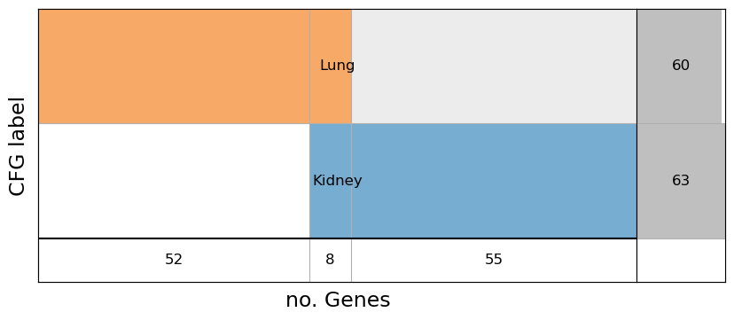
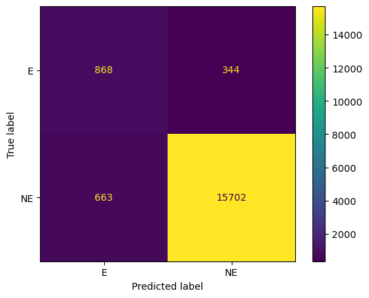

Load the CRISPR data file
=========================

.. code:: ipython3

    import pandas as pd
    df = pd.read_csv('CRISPRGeneEffect.csv').rename(columns={'Unnamed: 0': 'gene'}).set_index('gene').T
    print(f'{df.isna().sum().sum()} NaN over {len(df)*len(df.columns)} values')
    df

.. parsed-literal::

    739493 NaN over 20287300 values

.. raw:: html

    

    
    <table border="1" class="dataframe">
      <thead>
        <tr style="text-align: right;">
          <th>gene</th>
          <th>ACH-000001</th>
          <th>ACH-000004</th>
          <th>ACH-000005</th>
          <th>ACH-000007</th>
          <th>ACH-000009</th>
          <th>ACH-000011</th>
          <th>ACH-000012</th>
          <th>ACH-000013</th>
          <th>ACH-000015</th>
          <th>ACH-000017</th>
          <th>...</th>
          <th>ACH-002693</th>
          <th>ACH-002710</th>
          <th>ACH-002785</th>
          <th>ACH-002799</th>
          <th>ACH-002800</th>
          <th>ACH-002834</th>
          <th>ACH-002847</th>
          <th>ACH-002922</th>
          <th>ACH-002925</th>
          <th>ACH-002926</th>
        </tr>
      </thead>
      <tbody>
        <tr>
          <th>A1BG</th>
          <td>-0.067900</td>
          <td>0.246489</td>
          <td>0.116946</td>
          <td>0.141364</td>
          <td>0.204627</td>
          <td>0.199785</td>
          <td>0.047633</td>
          <td>0.132706</td>
          <td>-0.028936</td>
          <td>0.199793</td>
          <td>...</td>
          <td>0.083423</td>
          <td>0.124582</td>
          <td>0.137087</td>
          <td>0.144504</td>
          <td>0.223325</td>
          <td>0.243189</td>
          <td>0.191043</td>
          <td>0.192114</td>
          <td>0.138538</td>
          <td>0.115418</td>
        </tr>
        <tr>
          <th>A1CF</th>
          <td>0.250871</td>
          <td>0.089916</td>
          <td>0.128784</td>
          <td>0.076948</td>
          <td>-0.126732</td>
          <td>0.081220</td>
          <td>0.169218</td>
          <td>0.021871</td>
          <td>0.067442</td>
          <td>0.096989</td>
          <td>...</td>
          <td>-0.052777</td>
          <td>0.060578</td>
          <td>0.097634</td>
          <td>0.047610</td>
          <td>0.028740</td>
          <td>-0.063019</td>
          <td>0.042173</td>
          <td>0.175067</td>
          <td>0.134842</td>
          <td>0.086125</td>
        </tr>
        <tr>
          <th>A2M</th>
          <td>0.274015</td>
          <td>0.031482</td>
          <td>0.319054</td>
          <td>0.288501</td>
          <td>0.226243</td>
          <td>0.272090</td>
          <td>0.377333</td>
          <td>0.271504</td>
          <td>0.128924</td>
          <td>0.211882</td>
          <td>...</td>
          <td>-0.047640</td>
          <td>0.340740</td>
          <td>0.300681</td>
          <td>0.313502</td>
          <td>0.524181</td>
          <td>0.333656</td>
          <td>0.255575</td>
          <td>0.240830</td>
          <td>0.276676</td>
          <td>0.273820</td>
        </tr>
        <tr>
          <th>A2ML1</th>
          <td>0.075889</td>
          <td>0.109902</td>
          <td>0.291823</td>
          <td>0.327756</td>
          <td>0.237872</td>
          <td>0.395287</td>
          <td>0.365828</td>
          <td>0.314884</td>
          <td>0.241053</td>
          <td>0.206102</td>
          <td>...</td>
          <td>0.152519</td>
          <td>0.245650</td>
          <td>0.244936</td>
          <td>0.294257</td>
          <td>0.292241</td>
          <td>0.283028</td>
          <td>0.244974</td>
          <td>0.504381</td>
          <td>0.107654</td>
          <td>0.317229</td>
        </tr>
        <tr>
          <th>A3GALT2</th>
          <td>0.191038</td>
          <td>0.102362</td>
          <td>-0.073505</td>
          <td>0.241357</td>
          <td>0.252697</td>
          <td>0.092693</td>
          <td>0.233554</td>
          <td>0.017157</td>
          <td>0.115977</td>
          <td>-0.152689</td>
          <td>...</td>
          <td>0.094379</td>
          <td>0.013333</td>
          <td>-0.087394</td>
          <td>0.116945</td>
          <td>-0.148314</td>
          <td>-0.079305</td>
          <td>0.090090</td>
          <td>-0.073189</td>
          <td>0.030619</td>
          <td>0.038758</td>
        </tr>
        <tr>
          <th>...</th>
          <td>...</td>
          <td>...</td>
          <td>...</td>
          <td>...</td>
          <td>...</td>
          <td>...</td>
          <td>...</td>
          <td>...</td>
          <td>...</td>
          <td>...</td>
          <td>...</td>
          <td>...</td>
          <td>...</td>
          <td>...</td>
          <td>...</td>
          <td>...</td>
          <td>...</td>
          <td>...</td>
          <td>...</td>
          <td>...</td>
          <td>...</td>
        </tr>
        <tr>
          <th>ZYG11A</th>
          <td>-0.097182</td>
          <td>0.183259</td>
          <td>-0.092529</td>
          <td>0.142714</td>
          <td>0.035827</td>
          <td>0.264482</td>
          <td>0.124742</td>
          <td>0.003222</td>
          <td>0.164375</td>
          <td>0.103895</td>
          <td>...</td>
          <td>-0.235397</td>
          <td>0.064620</td>
          <td>0.007529</td>
          <td>0.123302</td>
          <td>0.087072</td>
          <td>0.193144</td>
          <td>0.119218</td>
          <td>0.063560</td>
          <td>0.113728</td>
          <td>0.139908</td>
        </tr>
        <tr>
          <th>ZYG11B</th>
          <td>0.156179</td>
          <td>-0.330767</td>
          <td>-0.104164</td>
          <td>-0.274978</td>
          <td>-0.516973</td>
          <td>-0.066404</td>
          <td>-0.053478</td>
          <td>-0.054749</td>
          <td>-0.053843</td>
          <td>-0.144417</td>
          <td>...</td>
          <td>-0.290373</td>
          <td>-0.012727</td>
          <td>-0.202033</td>
          <td>-0.000738</td>
          <td>-0.202761</td>
          <td>0.169203</td>
          <td>-0.092493</td>
          <td>-0.196123</td>
          <td>-0.227608</td>
          <td>-0.167942</td>
        </tr>
        <tr>
          <th>ZYX</th>
          <td>0.303797</td>
          <td>0.379213</td>
          <td>0.214313</td>
          <td>0.056294</td>
          <td>0.281592</td>
          <td>0.101403</td>
          <td>0.057374</td>
          <td>0.188838</td>
          <td>0.040658</td>
          <td>0.288018</td>
          <td>...</td>
          <td>0.269518</td>
          <td>-0.115229</td>
          <td>0.068203</td>
          <td>0.108157</td>
          <td>0.065240</td>
          <td>-0.140377</td>
          <td>-0.030886</td>
          <td>0.072723</td>
          <td>-0.047618</td>
          <td>0.248058</td>
        </tr>
        <tr>
          <th>ZZEF1</th>
          <td>0.305751</td>
          <td>0.374355</td>
          <td>0.046273</td>
          <td>-0.188169</td>
          <td>0.074025</td>
          <td>-0.017005</td>
          <td>0.052719</td>
          <td>-0.023496</td>
          <td>-0.063372</td>
          <td>-0.108468</td>
          <td>...</td>
          <td>-0.162302</td>
          <td>0.111218</td>
          <td>0.056447</td>
          <td>0.185166</td>
          <td>-0.022463</td>
          <td>-0.073816</td>
          <td>0.033274</td>
          <td>0.166055</td>
          <td>0.064585</td>
          <td>0.037409</td>
        </tr>
        <tr>
          <th>ZZZ3</th>
          <td>-0.328268</td>
          <td>0.029423</td>
          <td>-0.044436</td>
          <td>-0.279709</td>
          <td>-0.221695</td>
          <td>-0.174012</td>
          <td>-0.238549</td>
          <td>-0.462415</td>
          <td>-0.129166</td>
          <td>-0.093973</td>
          <td>...</td>
          <td>-0.142057</td>
          <td>-0.172703</td>
          <td>-0.099805</td>
          <td>-0.013678</td>
          <td>-0.007409</td>
          <td>-0.509138</td>
          <td>-0.335488</td>
          <td>-0.244113</td>
          <td>-0.127019</td>
          <td>-0.325076</td>
        </tr>
      </tbody>
    </table>
    
18443 rows × 1100 columns

    

Load the map between cell lines and tissues
===========================================

.. code:: ipython3

    import numpy as np
    df_map = pd.read_csv('Model.csv')
    print(df_map[['OncotreeLineage']].value_counts())
    df_map

.. parsed-literal::

    OncotreeLineage          
    Lung                         249
    Lymphoid                     211
    CNS/Brain                    122
    Skin                         120
    Esophagus/Stomach             95
    Breast                        94
    Bowel                         89
    Head and Neck                 84
    Bone                          77
    Myeloid                       77
    Ovary/Fallopian Tube          75
    Kidney                        73
    Pancreas                      66
    Peripheral Nervous System     56
    Soft Tissue                   55
    Biliary Tract                 44
    Uterus                        41
    Fibroblast                    41
    Bladder/Urinary Tract         39
    Normal                        39
    Pleura                        35
    Liver                         29
    Cervix                        25
    Eye                           21
    Thyroid                       18
    Prostate                      15
    Testis                         7
    Vulva/Vagina                   5
    Muscle                         5
    Ampulla of Vater               4
    Hair                           2
    Other                          1
    Embryonal                      1
    Adrenal Gland                  1
    Name: count, dtype: int64

.. raw:: html

    

    
    <table border="1" class="dataframe">
      <thead>
        <tr style="text-align: right;">
          <th></th>
          <th>ModelID</th>
          <th>PatientID</th>
          <th>CellLineName</th>
          <th>StrippedCellLineName</th>
          <th>DepmapModelType</th>
          <th>OncotreeLineage</th>
          <th>OncotreePrimaryDisease</th>
          <th>OncotreeSubtype</th>
          <th>OncotreeCode</th>
          <th>LegacyMolecularSubtype</th>
          <th>...</th>
          <th>TissueOrigin</th>
          <th>CCLEName</th>
          <th>CatalogNumber</th>
          <th>PlateCoating</th>
          <th>ModelDerivationMaterial</th>
          <th>PublicComments</th>
          <th>WTSIMasterCellID</th>
          <th>SangerModelID</th>
          <th>COSMICID</th>
          <th>LegacySubSubtype</th>
        </tr>
      </thead>
      <tbody>
        <tr>
          <th>0</th>
          <td>ACH-000001</td>
          <td>PT-gj46wT</td>
          <td>NIH:OVCAR-3</td>
          <td>NIHOVCAR3</td>
          <td>HGSOC</td>
          <td>Ovary/Fallopian Tube</td>
          <td>Ovarian Epithelial Tumor</td>
          <td>High-Grade Serous Ovarian Cancer</td>
          <td>HGSOC</td>
          <td>NaN</td>
          <td>...</td>
          <td>NaN</td>
          <td>NIHOVCAR3_OVARY</td>
          <td>HTB-71</td>
          <td>NaN</td>
          <td>NaN</td>
          <td>NaN</td>
          <td>2201.0</td>
          <td>SIDM00105</td>
          <td>905933.0</td>
          <td>high_grade_serous</td>
        </tr>
        <tr>
          <th>1</th>
          <td>ACH-000002</td>
          <td>PT-5qa3uk</td>
          <td>HL-60</td>
          <td>HL60</td>
          <td>AML</td>
          <td>Myeloid</td>
          <td>Acute Myeloid Leukemia</td>
          <td>Acute Myeloid Leukemia</td>
          <td>AML</td>
          <td>NaN</td>
          <td>...</td>
          <td>NaN</td>
          <td>HL60_HAEMATOPOIETIC_AND_LYMPHOID_TISSUE</td>
          <td>CCL-240</td>
          <td>NaN</td>
          <td>NaN</td>
          <td>NaN</td>
          <td>55.0</td>
          <td>SIDM00829</td>
          <td>905938.0</td>
          <td>M3</td>
        </tr>
        <tr>
          <th>2</th>
          <td>ACH-000003</td>
          <td>PT-puKIyc</td>
          <td>CACO2</td>
          <td>CACO2</td>
          <td>COAD</td>
          <td>Bowel</td>
          <td>Colorectal Adenocarcinoma</td>
          <td>Colon Adenocarcinoma</td>
          <td>COAD</td>
          <td>NaN</td>
          <td>...</td>
          <td>NaN</td>
          <td>CACO2_LARGE_INTESTINE</td>
          <td>HTB-37</td>
          <td>NaN</td>
          <td>NaN</td>
          <td>NaN</td>
          <td>NaN</td>
          <td>SIDM00891</td>
          <td>NaN</td>
          <td>NaN</td>
        </tr>
        <tr>
          <th>3</th>
          <td>ACH-000004</td>
          <td>PT-q4K2cp</td>
          <td>HEL</td>
          <td>HEL</td>
          <td>AML</td>
          <td>Myeloid</td>
          <td>Acute Myeloid Leukemia</td>
          <td>Acute Myeloid Leukemia</td>
          <td>AML</td>
          <td>NaN</td>
          <td>...</td>
          <td>NaN</td>
          <td>HEL_HAEMATOPOIETIC_AND_LYMPHOID_TISSUE</td>
          <td>ACC 11</td>
          <td>NaN</td>
          <td>NaN</td>
          <td>NaN</td>
          <td>783.0</td>
          <td>SIDM00594</td>
          <td>907053.0</td>
          <td>M6</td>
        </tr>
        <tr>
          <th>4</th>
          <td>ACH-000005</td>
          <td>PT-q4K2cp</td>
          <td>HEL 92.1.7</td>
          <td>HEL9217</td>
          <td>AML</td>
          <td>Myeloid</td>
          <td>Acute Myeloid Leukemia</td>
          <td>Acute Myeloid Leukemia</td>
          <td>AML</td>
          <td>NaN</td>
          <td>...</td>
          <td>NaN</td>
          <td>HEL9217_HAEMATOPOIETIC_AND_LYMPHOID_TISSUE</td>
          <td>HEL9217</td>
          <td>NaN</td>
          <td>NaN</td>
          <td>NaN</td>
          <td>NaN</td>
          <td>SIDM00593</td>
          <td>NaN</td>
          <td>M6</td>
        </tr>
        <tr>
          <th>...</th>
          <td>...</td>
          <td>...</td>
          <td>...</td>
          <td>...</td>
          <td>...</td>
          <td>...</td>
          <td>...</td>
          <td>...</td>
          <td>...</td>
          <td>...</td>
          <td>...</td>
          <td>...</td>
          <td>...</td>
          <td>...</td>
          <td>...</td>
          <td>...</td>
          <td>...</td>
          <td>...</td>
          <td>...</td>
          <td>...</td>
          <td>...</td>
        </tr>
        <tr>
          <th>1916</th>
          <td>ACH-003157</td>
          <td>PT-QDEP9D</td>
          <td>ABM-T0822</td>
          <td>ABMT0822</td>
          <td>ZIMMMPLC</td>
          <td>Lung</td>
          <td>Non-Cancerous</td>
          <td>Immortalized MPLC Cells</td>
          <td>NaN</td>
          <td>NaN</td>
          <td>...</td>
          <td>NaN</td>
          <td>NaN</td>
          <td>NaN</td>
          <td>NaN</td>
          <td>NaN</td>
          <td>NaN</td>
          <td>NaN</td>
          <td>NaN</td>
          <td>NaN</td>
          <td>NaN</td>
        </tr>
        <tr>
          <th>1917</th>
          <td>ACH-003158</td>
          <td>PT-nszsxG</td>
          <td>ABM-T9220</td>
          <td>ABMT9220</td>
          <td>ZIMMSMCI</td>
          <td>Muscle</td>
          <td>Non-Cancerous</td>
          <td>Immortalized Smooth Muscle Cells, Intestinal</td>
          <td>NaN</td>
          <td>NaN</td>
          <td>...</td>
          <td>NaN</td>
          <td>NaN</td>
          <td>NaN</td>
          <td>NaN</td>
          <td>NaN</td>
          <td>NaN</td>
          <td>NaN</td>
          <td>NaN</td>
          <td>NaN</td>
          <td>NaN</td>
        </tr>
        <tr>
          <th>1918</th>
          <td>ACH-003159</td>
          <td>PT-AUxVvV</td>
          <td>ABM-T9233</td>
          <td>ABMT9233</td>
          <td>ZIMMRSCH</td>
          <td>Hair</td>
          <td>Non-Cancerous</td>
          <td>Immortalized Hair Follicle Inner Root Sheath C...</td>
          <td>NaN</td>
          <td>NaN</td>
          <td>...</td>
          <td>NaN</td>
          <td>NaN</td>
          <td>NaN</td>
          <td>NaN</td>
          <td>NaN</td>
          <td>NaN</td>
          <td>NaN</td>
          <td>NaN</td>
          <td>NaN</td>
          <td>NaN</td>
        </tr>
        <tr>
          <th>1919</th>
          <td>ACH-003160</td>
          <td>PT-AUxVvV</td>
          <td>ABM-T9249</td>
          <td>ABMT9249</td>
          <td>ZIMMGMCH</td>
          <td>Hair</td>
          <td>Non-Cancerous</td>
          <td>Immortalized Hair Germinal Matrix Cells</td>
          <td>NaN</td>
          <td>NaN</td>
          <td>...</td>
          <td>NaN</td>
          <td>NaN</td>
          <td>NaN</td>
          <td>NaN</td>
          <td>NaN</td>
          <td>NaN</td>
          <td>NaN</td>
          <td>NaN</td>
          <td>NaN</td>
          <td>NaN</td>
        </tr>
        <tr>
          <th>1920</th>
          <td>ACH-003161</td>
          <td>PT-or1hkT</td>
          <td>ABM-T9430</td>
          <td>ABMT9430</td>
          <td>ZIMMPSC</td>
          <td>Pancreas</td>
          <td>Non-Cancerous</td>
          <td>Immortalized Pancreatic Stromal Cells</td>
          <td>NaN</td>
          <td>NaN</td>
          <td>...</td>
          <td>NaN</td>
          <td>NaN</td>
          <td>NaN</td>
          <td>NaN</td>
          <td>NaN</td>
          <td>NaN</td>
          <td>NaN</td>
          <td>NaN</td>
          <td>NaN</td>
          <td>NaN</td>
        </tr>
      </tbody>
    </table>
    
1921 rows × 36 columns

    

Imputation of data
==================

In this cell we apply KNN imputation to data cell lines, that may
contain missing values (NaN). We can apply imputation intwo modalities:
1. based on all cell lines, 1. or grouping cell lines by belonging
tissue.

It takes almost 5 minutes…

.. code:: ipython3

    from help.preprocess.imputer import imputer_knn, imputer_knn_group
    #df = imputer_knn(df)
    df = imputer_knn_group(df, df_map, verbose=True)

.. parsed-literal::

    Imputation groups ['Ampulla of Vater' 'Biliary Tract' 'Bladder/Urinary Tract' 'Bone' 'Bowel'
     'Breast' 'CNS/Brain' 'Cervix' 'Esophagus/Stomach' 'Eye' 'Head and Neck'
     'Kidney' 'Liver' 'Lung' 'Lymphoid' 'Myeloid' 'Other'
     'Ovary/Fallopian Tube' 'Pancreas' 'Peripheral Nervous System' 'Pleura'
     'Prostate' 'Skin' 'Soft Tissue' 'Testis' 'Thyroid' 'Uterus'
     'Vulva/Vagina']...

.. parsed-literal::

    100%|████████████████████████████████████████████████████████████████████████| 28/28 [02:10<00:00,  4.65s/it]

Select all tissues (pan-tissue)
===============================

We can apply labelling algorithm to all cell lines (pan-tissue).

.. code:: ipython3

    from help.models.labelling import Help
    df_label = Help(verbose=True).labelling(df, columns=[], three_class=False)
    df_label.to_csv("label_PanTissue.csv")

.. parsed-literal::

    100%|███████████████████████████████████████████████████████████████████| 1100/1100 [00:06<00:00, 170.84it/s]

Select some tissues
===================

or we can apply labelling algorithm to a set of tissues.

.. code:: ipython3

    from help.models.labelling import Help
    from help.utility.selection import select_cell_lines
    cell_lines = select_cell_lines(df, df_map, ['Kidney'])
    df_label = Help(verbose=True).labelling(df, columns=cell_lines, three_class=False)
    df_label.to_csv("label_Kidney.csv")

.. parsed-literal::

    100%|██████████████████████████████████████████████████████████████████████| 37/37 [00:00<00:00, 1062.18it/s]

In this example you use a UI for selecting tissues to focus on. A slider
allows you to set the minimum number of lines the tissue must have
(default is 1).

.. code:: ipython3

    cell_lines = select_cell_lines(df, df_map, ['Lung'])
    df_label = Help(verbose=True).labelling(df, columns=cell_lines, three_class=False)
    df_label.to_csv("label_Lung.csv")

.. parsed-literal::

    100%|█████████████████████████████████████████████████████████████████████| 119/119 [00:00<00:00, 894.68it/s]

Context specific EGs
====================

In this section we make the difference between pan-tissue EGs (common
EGs) and tissue EGs to get the context-specific EGs for the tissue
(csEGs).

.. code:: ipython3

    from help.utility.selection import EG_tissues_intersect
    csEGs, overlap, diffs = EG_tissues_intersect(tissues = {'Kidney': pd.read_csv('label_Kidney.csv', index_col=0),
                                                            'Lung': pd.read_csv('label_Lung.csv', index_col=0)
                                                           }, 
                            common_df = pd.read_csv('label_PanTissue.csv', index_col=0),
                            display=True, verbose=True)

.. parsed-literal::

    Subtracting 1246 common EGs...
    Overlapping of 8 genes between ['Kidney', 'Lung']
    55 genes only in Kidney
    52 genes only in Lung

then we save the csEGs into a file.

.. code:: ipython3

    with open('csEG_Kidney.txt', 'w') as f:
        f.write('\n'.join(list(csEGs['Kidney'])))
    with open('csEG_Lung.txt', 'w') as f:
        f.write('\n'.join(list(csEGs['Lung'])))

Process the tissue attributes
=============================

In this code we load tissue gene attributes by several datafiles. We can
apply missin values fixing and data scaling.

.. code:: ipython3

    from help.preprocess.loaders import feature_assemble
    import os
    label_file = 'label_Kidney.csv'
    features = [{'fname': 'Kidney_BIO.csv', 'fixna' : True, 'normalize': 'std'},
                {'fname': 'Kidney_CCcfs.csv', 'fixna' : True, 'normalize': 'std'}
               ]
    df_X, df_y = feature_assemble(label_file = label_file, 
                               features=features, subsample=False, seed=1, saveflag=False, verbose=True)

.. parsed-literal::

    Loading label_Kidney.csv
    [Kidney_BIO.csv] found 0 Nan...
    [Kidney_BIO.csv] Normalization with std ...
    [Kidney_CCcfs.csv] found 0 Nan...
    [Kidney_CCcfs.csv] Normalization with std ...
    17577 labeled genes over a total of 18443
    (17577, 3331) data input

Prediction
==========

We process k-fold cross validation of a LightGBM classifier, and then
storing predictions andprinting metrics.

.. code:: ipython3

    from help.models.prediction import predict_cv
    predict_cv(df_X, df_y, n_splits=5, balanced=True, display=True, outfile='pred_Kidney.csv') 

.. parsed-literal::

    {'E': 0, 'NE': 1}
    label
    NE       16365
    E         1212
    Name: count, dtype: int64

.. parsed-literal::

    5-fold: 100%|██████████████████████████████████████████████████████████████████| 5/5 [00:25<00:00,  5.07s/it]

.. raw:: html

    

    
    <table border="1" class="dataframe">
      <thead>
        <tr style="text-align: right;">
          <th></th>
          <th>measure</th>
        </tr>
      </thead>
      <tbody>
        <tr>
          <th>ROC-AUC</th>
          <td>0.9485±0.0054</td>
        </tr>
        <tr>
          <th>Accuracy</th>
          <td>0.9427±0.0031</td>
        </tr>
        <tr>
          <th>BA</th>
          <td>0.8378±0.0148</td>
        </tr>
        <tr>
          <th>Sensitivity</th>
          <td>0.7161±0.0285</td>
        </tr>
        <tr>
          <th>Specificity</th>
          <td>0.9595±0.0015</td>
        </tr>
        <tr>
          <th>MCC</th>
          <td>0.6070±0.0241</td>
        </tr>
        <tr>
          <th>CM</th>
          <td>[[868, 344], [663, 15702]]</td>
        </tr>
      </tbody>
    </table>
    

