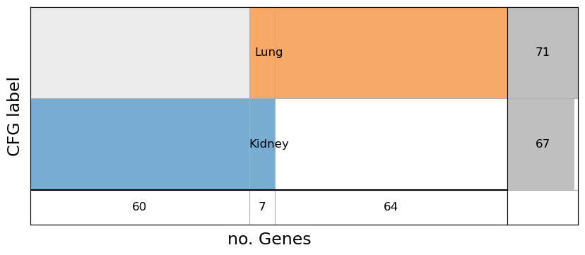
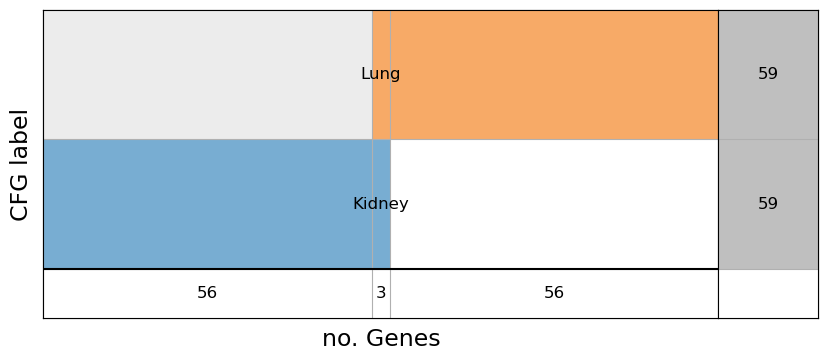

Set data path
=============

.. code:: ipython3

    datapath = "<your-data-path>"
    import warnings
    warnings.filterwarnings("ignore")
    datapath = "../data"

Load the CRISPR data file
=========================

.. code:: ipython3

    import pandas as pd
    pd.set_option('display.max_columns', 10)
    import os
    df_orig = pd.read_csv(os.path.join(datapath, "CRISPRGeneEffect.csv")).rename(columns={'Unnamed: 0': 'gene'}).rename(columns=lambda x: x.split(' ')[0]).set_index('gene').T
    print(f'{df.isna().sum().sum()} NaN over {len(df)*len(df.columns)} values')
    df_orig

.. parsed-literal::

    739493 NaN over 20287300 values

.. raw:: html

    

    
    <table border="1" class="dataframe">
      <thead>
        <tr style="text-align: right;">
          <th>gene</th>
          <th>ACH-000001</th>
          <th>ACH-000004</th>
          <th>ACH-000005</th>
          <th>ACH-000007</th>
          <th>ACH-000009</th>
          <th>...</th>
          <th>ACH-002834</th>
          <th>ACH-002847</th>
          <th>ACH-002922</th>
          <th>ACH-002925</th>
          <th>ACH-002926</th>
        </tr>
      </thead>
      <tbody>
        <tr>
          <th>A1BG</th>
          <td>-0.122637</td>
          <td>0.019756</td>
          <td>-0.107208</td>
          <td>-0.031027</td>
          <td>0.008888</td>
          <td>...</td>
          <td>-0.055721</td>
          <td>-0.009973</td>
          <td>-0.025991</td>
          <td>-0.127639</td>
          <td>-0.068666</td>
        </tr>
        <tr>
          <th>A1CF</th>
          <td>0.025881</td>
          <td>-0.083640</td>
          <td>-0.023211</td>
          <td>-0.137850</td>
          <td>-0.146566</td>
          <td>...</td>
          <td>-0.121228</td>
          <td>-0.119813</td>
          <td>-0.007706</td>
          <td>-0.040705</td>
          <td>-0.107530</td>
        </tr>
        <tr>
          <th>A2M</th>
          <td>0.034217</td>
          <td>-0.060118</td>
          <td>0.200204</td>
          <td>0.067704</td>
          <td>0.084471</td>
          <td>...</td>
          <td>0.072790</td>
          <td>0.044097</td>
          <td>-0.038468</td>
          <td>0.134556</td>
          <td>0.067806</td>
        </tr>
        <tr>
          <th>A2ML1</th>
          <td>-0.128082</td>
          <td>-0.027417</td>
          <td>0.116039</td>
          <td>0.107988</td>
          <td>0.089419</td>
          <td>...</td>
          <td>0.021916</td>
          <td>0.041358</td>
          <td>0.236576</td>
          <td>-0.047984</td>
          <td>0.112071</td>
        </tr>
        <tr>
          <th>A3GALT2</th>
          <td>-0.031285</td>
          <td>-0.036116</td>
          <td>-0.172227</td>
          <td>0.007992</td>
          <td>0.065109</td>
          <td>...</td>
          <td>-0.221940</td>
          <td>-0.146565</td>
          <td>-0.239690</td>
          <td>-0.116114</td>
          <td>-0.149897</td>
        </tr>
        <tr>
          <th>...</th>
          <td>...</td>
          <td>...</td>
          <td>...</td>
          <td>...</td>
          <td>...</td>
          <td>...</td>
          <td>...</td>
          <td>...</td>
          <td>...</td>
          <td>...</td>
          <td>...</td>
        </tr>
        <tr>
          <th>ZYG11A</th>
          <td>-0.289724</td>
          <td>0.032983</td>
          <td>-0.201273</td>
          <td>-0.100344</td>
          <td>-0.112703</td>
          <td>...</td>
          <td>0.024959</td>
          <td>-0.119911</td>
          <td>-0.079342</td>
          <td>-0.043555</td>
          <td>-0.045115</td>
        </tr>
        <tr>
          <th>ZYG11B</th>
          <td>-0.062972</td>
          <td>-0.410392</td>
          <td>-0.178877</td>
          <td>-0.462160</td>
          <td>-0.598698</td>
          <td>...</td>
          <td>0.015259</td>
          <td>-0.289412</td>
          <td>-0.347484</td>
          <td>-0.335270</td>
          <td>-0.307900</td>
        </tr>
        <tr>
          <th>ZYX</th>
          <td>0.074180</td>
          <td>0.113156</td>
          <td>-0.055349</td>
          <td>-0.001555</td>
          <td>0.095877</td>
          <td>...</td>
          <td>-0.306562</td>
          <td>-0.195097</td>
          <td>-0.085302</td>
          <td>-0.208063</td>
          <td>0.070671</td>
        </tr>
        <tr>
          <th>ZZEF1</th>
          <td>0.111244</td>
          <td>0.234388</td>
          <td>-0.002161</td>
          <td>-0.325964</td>
          <td>-0.026742</td>
          <td>...</td>
          <td>-0.148368</td>
          <td>-0.206400</td>
          <td>-0.095965</td>
          <td>-0.094741</td>
          <td>-0.187813</td>
        </tr>
        <tr>
          <th>ZZZ3</th>
          <td>-0.467908</td>
          <td>-0.088306</td>
          <td>-0.186842</td>
          <td>-0.486660</td>
          <td>-0.320759</td>
          <td>...</td>
          <td>-0.579576</td>
          <td>-0.486525</td>
          <td>-0.346272</td>
          <td>-0.222404</td>
          <td>-0.452143</td>
        </tr>
      </tbody>
    </table>
    
18443 rows × 1100 columns

    

Load the map between cell lines and tissues
===========================================

In this code we load the file that maps cell-lines identifiers (column
``ModelID``) to tissue, disease or tumor type (respectively:
``OncotreeLineage``, ``OncotreePrimaryDisease``, ``OncotreeSubtype``).
As a second step, we print the counts of lines for each tissue.

.. code:: ipython3

    df_map = pd.read_csv(os.path.join(datapath, "Model.csv"))
    print(df_map[['OncotreeLineage']].value_counts())
    df_map

.. parsed-literal::

    OncotreeLineage          
    Lung                         249
    Lymphoid                     211
    CNS/Brain                    122
    Skin                         120
    Esophagus/Stomach             95
    Breast                        94
    Bowel                         89
    Head and Neck                 84
    Bone                          77
    Myeloid                       77
    Ovary/Fallopian Tube          75
    Kidney                        73
    Pancreas                      66
    Peripheral Nervous System     56
    Soft Tissue                   55
    Biliary Tract                 44
    Uterus                        41
    Fibroblast                    41
    Bladder/Urinary Tract         39
    Normal                        39
    Pleura                        35
    Liver                         29
    Cervix                        25
    Eye                           21
    Thyroid                       18
    Prostate                      15
    Testis                         7
    Vulva/Vagina                   5
    Muscle                         5
    Ampulla of Vater               4
    Hair                           2
    Other                          1
    Embryonal                      1
    Adrenal Gland                  1
    Name: count, dtype: int64

.. raw:: html

    

    
    <table border="1" class="dataframe">
      <thead>
        <tr style="text-align: right;">
          <th></th>
          <th>ModelID</th>
          <th>PatientID</th>
          <th>CellLineName</th>
          <th>StrippedCellLineName</th>
          <th>DepmapModelType</th>
          <th>...</th>
          <th>PublicComments</th>
          <th>WTSIMasterCellID</th>
          <th>SangerModelID</th>
          <th>COSMICID</th>
          <th>LegacySubSubtype</th>
        </tr>
      </thead>
      <tbody>
        <tr>
          <th>0</th>
          <td>ACH-000001</td>
          <td>PT-gj46wT</td>
          <td>NIH:OVCAR-3</td>
          <td>NIHOVCAR3</td>
          <td>HGSOC</td>
          <td>...</td>
          <td>NaN</td>
          <td>2201.0</td>
          <td>SIDM00105</td>
          <td>905933.0</td>
          <td>high_grade_serous</td>
        </tr>
        <tr>
          <th>1</th>
          <td>ACH-000002</td>
          <td>PT-5qa3uk</td>
          <td>HL-60</td>
          <td>HL60</td>
          <td>AML</td>
          <td>...</td>
          <td>NaN</td>
          <td>55.0</td>
          <td>SIDM00829</td>
          <td>905938.0</td>
          <td>M3</td>
        </tr>
        <tr>
          <th>2</th>
          <td>ACH-000003</td>
          <td>PT-puKIyc</td>
          <td>CACO2</td>
          <td>CACO2</td>
          <td>COAD</td>
          <td>...</td>
          <td>NaN</td>
          <td>NaN</td>
          <td>SIDM00891</td>
          <td>NaN</td>
          <td>NaN</td>
        </tr>
        <tr>
          <th>3</th>
          <td>ACH-000004</td>
          <td>PT-q4K2cp</td>
          <td>HEL</td>
          <td>HEL</td>
          <td>AML</td>
          <td>...</td>
          <td>NaN</td>
          <td>783.0</td>
          <td>SIDM00594</td>
          <td>907053.0</td>
          <td>M6</td>
        </tr>
        <tr>
          <th>4</th>
          <td>ACH-000005</td>
          <td>PT-q4K2cp</td>
          <td>HEL 92.1.7</td>
          <td>HEL9217</td>
          <td>AML</td>
          <td>...</td>
          <td>NaN</td>
          <td>NaN</td>
          <td>SIDM00593</td>
          <td>NaN</td>
          <td>M6</td>
        </tr>
        <tr>
          <th>...</th>
          <td>...</td>
          <td>...</td>
          <td>...</td>
          <td>...</td>
          <td>...</td>
          <td>...</td>
          <td>...</td>
          <td>...</td>
          <td>...</td>
          <td>...</td>
          <td>...</td>
        </tr>
        <tr>
          <th>1916</th>
          <td>ACH-003157</td>
          <td>PT-QDEP9D</td>
          <td>ABM-T0822</td>
          <td>ABMT0822</td>
          <td>ZIMMMPLC</td>
          <td>...</td>
          <td>NaN</td>
          <td>NaN</td>
          <td>NaN</td>
          <td>NaN</td>
          <td>NaN</td>
        </tr>
        <tr>
          <th>1917</th>
          <td>ACH-003158</td>
          <td>PT-nszsxG</td>
          <td>ABM-T9220</td>
          <td>ABMT9220</td>
          <td>ZIMMSMCI</td>
          <td>...</td>
          <td>NaN</td>
          <td>NaN</td>
          <td>NaN</td>
          <td>NaN</td>
          <td>NaN</td>
        </tr>
        <tr>
          <th>1918</th>
          <td>ACH-003159</td>
          <td>PT-AUxVvV</td>
          <td>ABM-T9233</td>
          <td>ABMT9233</td>
          <td>ZIMMRSCH</td>
          <td>...</td>
          <td>NaN</td>
          <td>NaN</td>
          <td>NaN</td>
          <td>NaN</td>
          <td>NaN</td>
        </tr>
        <tr>
          <th>1919</th>
          <td>ACH-003160</td>
          <td>PT-AUxVvV</td>
          <td>ABM-T9249</td>
          <td>ABMT9249</td>
          <td>ZIMMGMCH</td>
          <td>...</td>
          <td>NaN</td>
          <td>NaN</td>
          <td>NaN</td>
          <td>NaN</td>
          <td>NaN</td>
        </tr>
        <tr>
          <th>1920</th>
          <td>ACH-003161</td>
          <td>PT-or1hkT</td>
          <td>ABM-T9430</td>
          <td>ABMT9430</td>
          <td>ZIMMPSC</td>
          <td>...</td>
          <td>NaN</td>
          <td>NaN</td>
          <td>NaN</td>
          <td>NaN</td>
          <td>NaN</td>
        </tr>
      </tbody>
    </table>
    
1921 rows × 36 columns

    

Common Egs (pan-tissue labelling)
=================================

We can apply the labelling algorithm to all cell lines present in the
CRISPR data file to compute the common essential genes, i.e. the
*pan-tissue* (or pan-cancer, pan-disease, etc). This set of labels will
be used in the following to get the context-specific essential genes for
single tissue.

Ignoring in Model tissue with few cell-lines
~~~~~~~~~~~~~~~~~~~~~~~~~~~~~~~~~~~~~~~~~~~~

in this code we select in the CRISPR data file only cell lines belonging
to tissue reported in the Model such that the number of lines is greater
(or equal) to a specific amount.

.. code:: ipython3

    from help.utility.selection import filter_crispr_by_model
    df = filter_crispr_by_model(df_orig, df_map, minlines=10, line_group='OncotreeLineage')
    df

.. raw:: html

    

    
    <table border="1" class="dataframe">
      <thead>
        <tr style="text-align: right;">
          <th>gene</th>
          <th>ACH-000001</th>
          <th>ACH-000004</th>
          <th>ACH-000005</th>
          <th>ACH-000007</th>
          <th>ACH-000009</th>
          <th>...</th>
          <th>ACH-002834</th>
          <th>ACH-002847</th>
          <th>ACH-002922</th>
          <th>ACH-002925</th>
          <th>ACH-002926</th>
        </tr>
      </thead>
      <tbody>
        <tr>
          <th>A1BG</th>
          <td>-0.122637</td>
          <td>0.019756</td>
          <td>-0.107208</td>
          <td>-0.031027</td>
          <td>0.008888</td>
          <td>...</td>
          <td>-0.055721</td>
          <td>-0.009973</td>
          <td>-0.025991</td>
          <td>-0.127639</td>
          <td>-0.068666</td>
        </tr>
        <tr>
          <th>A1CF</th>
          <td>0.025881</td>
          <td>-0.083640</td>
          <td>-0.023211</td>
          <td>-0.137850</td>
          <td>-0.146566</td>
          <td>...</td>
          <td>-0.121228</td>
          <td>-0.119813</td>
          <td>-0.007706</td>
          <td>-0.040705</td>
          <td>-0.107530</td>
        </tr>
        <tr>
          <th>A2M</th>
          <td>0.034217</td>
          <td>-0.060118</td>
          <td>0.200204</td>
          <td>0.067704</td>
          <td>0.084471</td>
          <td>...</td>
          <td>0.072790</td>
          <td>0.044097</td>
          <td>-0.038468</td>
          <td>0.134556</td>
          <td>0.067806</td>
        </tr>
        <tr>
          <th>A2ML1</th>
          <td>-0.128082</td>
          <td>-0.027417</td>
          <td>0.116039</td>
          <td>0.107988</td>
          <td>0.089419</td>
          <td>...</td>
          <td>0.021916</td>
          <td>0.041358</td>
          <td>0.236576</td>
          <td>-0.047984</td>
          <td>0.112071</td>
        </tr>
        <tr>
          <th>A3GALT2</th>
          <td>-0.031285</td>
          <td>-0.036116</td>
          <td>-0.172227</td>
          <td>0.007992</td>
          <td>0.065109</td>
          <td>...</td>
          <td>-0.221940</td>
          <td>-0.146565</td>
          <td>-0.239690</td>
          <td>-0.116114</td>
          <td>-0.149897</td>
        </tr>
        <tr>
          <th>...</th>
          <td>...</td>
          <td>...</td>
          <td>...</td>
          <td>...</td>
          <td>...</td>
          <td>...</td>
          <td>...</td>
          <td>...</td>
          <td>...</td>
          <td>...</td>
          <td>...</td>
        </tr>
        <tr>
          <th>ZYG11A</th>
          <td>-0.289724</td>
          <td>0.032983</td>
          <td>-0.201273</td>
          <td>-0.100344</td>
          <td>-0.112703</td>
          <td>...</td>
          <td>0.024959</td>
          <td>-0.119911</td>
          <td>-0.079342</td>
          <td>-0.043555</td>
          <td>-0.045115</td>
        </tr>
        <tr>
          <th>ZYG11B</th>
          <td>-0.062972</td>
          <td>-0.410392</td>
          <td>-0.178877</td>
          <td>-0.462160</td>
          <td>-0.598698</td>
          <td>...</td>
          <td>0.015259</td>
          <td>-0.289412</td>
          <td>-0.347484</td>
          <td>-0.335270</td>
          <td>-0.307900</td>
        </tr>
        <tr>
          <th>ZYX</th>
          <td>0.074180</td>
          <td>0.113156</td>
          <td>-0.055349</td>
          <td>-0.001555</td>
          <td>0.095877</td>
          <td>...</td>
          <td>-0.306562</td>
          <td>-0.195097</td>
          <td>-0.085302</td>
          <td>-0.208063</td>
          <td>0.070671</td>
        </tr>
        <tr>
          <th>ZZEF1</th>
          <td>0.111244</td>
          <td>0.234388</td>
          <td>-0.002161</td>
          <td>-0.325964</td>
          <td>-0.026742</td>
          <td>...</td>
          <td>-0.148368</td>
          <td>-0.206400</td>
          <td>-0.095965</td>
          <td>-0.094741</td>
          <td>-0.187813</td>
        </tr>
        <tr>
          <th>ZZZ3</th>
          <td>-0.467908</td>
          <td>-0.088306</td>
          <td>-0.186842</td>
          <td>-0.486660</td>
          <td>-0.320759</td>
          <td>...</td>
          <td>-0.579576</td>
          <td>-0.486525</td>
          <td>-0.346272</td>
          <td>-0.222404</td>
          <td>-0.452143</td>
        </tr>
      </tbody>
    </table>
    
18443 rows × 1091 columns

    

labelling EGs across tissues
~~~~~~~~~~~~~~~~~~~~~~~~~~~~

In this example we compute common EGs by applying the labelling
algorithm within each tissue-specufic cell lines. Then the common
essentiality label is computed by making the mode of previously-computed
labels across tissue. In order to do that, we with need to select
cell-lines form the ``Model.csv`` as a nested list of lists of
cell-lines. THis is obtained by properly calling the
``select-cell-Lines`` function.

.. code:: ipython3

    from help.utility.selection import select_cell_lines, delrows_with_nan_percentage
    from help.models.labelling import labelling
    cell_lines = select_cell_lines(df, df_map, tissue_list='all', nested=True)
    print(f"Selecting {len(cell_lines)} tissue for a total of {len([len(x) for x in cell_lines])} cell-lines")

.. parsed-literal::

    Selecting 24 tissue for a total of 24 cell-lines

Once selected the tissues as a nested list of cell-lines, we can apply
the labelling algorithm with the following coee. Note that we remove
from the CRIPSR matrix those genes with a percentage of missing values
greater than 80%.

.. code:: ipython3

    from help.utility.selection import delrows_with_nan_percentage
    from help.models.labelling import labelling
    # remove rows with all nans
    df_nonan = delrows_with_nan_percentage(df, perc=80)
    df_label = labelling(df_nonan, columns=cell_lines, n_classes=2, labelnames={1: 'NE', 0: 'E'}, 
                         mode='flat-multi', algorithm='otsu')
    df_label.to_csv(os.path.join(datapath, "label_PanTissue_group.csv"))
    df_label.value_counts(), f"Nan: {df_label['label'].isna().sum()}"

.. parsed-literal::

    Removed 512 rows from 18443 with at least 80% NaN

.. parsed-literal::

    100%|██████████| 34/34 [00:00<00:00, 536.51it/s]
    100%|██████████| 32/32 [00:00<00:00, 735.38it/s]
    100%|██████████| 37/37 [00:00<00:00, 732.73it/s]
    100%|██████████| 59/59 [00:00<00:00, 727.16it/s]
    100%|██████████| 48/48 [00:00<00:00, 749.96it/s]
    100%|██████████| 86/86 [00:00<00:00, 747.68it/s]
    100%|██████████| 18/18 [00:00<00:00, 729.10it/s]
    100%|██████████| 65/65 [00:00<00:00, 737.15it/s]
    100%|██████████| 15/15 [00:00<00:00, 675.03it/s]
    100%|██████████| 72/72 [00:00<00:00, 736.44it/s]
    100%|██████████| 37/37 [00:00<00:00, 685.08it/s]
    100%|██████████| 24/24 [00:00<00:00, 744.16it/s]
    100%|██████████| 119/119 [00:00<00:00, 713.84it/s]
    100%|██████████| 81/81 [00:00<00:00, 715.60it/s]
    100%|██████████| 37/37 [00:00<00:00, 739.63it/s]
    100%|██████████| 59/59 [00:00<00:00, 757.11it/s]
    100%|██████████| 47/47 [00:00<00:00, 752.14it/s]
    100%|██████████| 41/41 [00:00<00:00, 730.64it/s]
    100%|██████████| 19/19 [00:00<00:00, 736.97it/s]
    100%|██████████| 10/10 [00:00<00:00, 649.65it/s]
    100%|██████████| 71/71 [00:00<00:00, 754.01it/s]
    100%|██████████| 36/36 [00:00<00:00, 741.70it/s]
    100%|██████████| 11/11 [00:00<00:00, 725.30it/s]
    100%|██████████| 33/33 [00:00<00:00, 711.01it/s]

.. parsed-literal::

    (label
     NE       16681
     E         1250
     Name: count, dtype: int64,
     'Nan: 0')

For comparison, let’s compute the common EGs by applying the labelling
to all tissue in a flat way. In this case all cell-lines contribute in
the same way to the labelling criterium regardless of the related
tissue.

.. code:: ipython3

    from help.utility.selection import select_cell_lines, delrows_with_nan_percentage
    from help.models.labelling import labelling
    cell_lines = select_cell_lines(df, df_map, tissue_list='all', nested=False)
    print(f"Selecting {len([len(x) for x in cell_lines])} cell-lines")

.. parsed-literal::

    Selecting 1091 cell-lines

Once selected all cell-lines as a flat list of identifiers, we can apply
the labelling algorithm with the following code. Also in this case we
remove from the CRIPSR matrix those genes with a percentage of missing
values greater than 80%.

.. code:: ipython3

    from help.utility.selection import delrows_with_nan_percentage
    from help.models.labelling import labelling
    # remove rows with all nans
    df_nonan = delrows_with_nan_percentage(df, perc=80)
    df_label = labelling(df_nonan, columns=cell_lines, n_classes=2, labelnames={1: 'NE', 0: 'E'}, 
                         mode='flat-multi', algorithm='otsu')
    df_label.to_csv(os.path.join(datapath, "label_PanTissue.csv"))
    df_label.value_counts(), f"Nan: {df_label['label'].isna().sum()}"

.. parsed-literal::

    Removed 512 rows from 18443 with at least 80% NaN

.. parsed-literal::

    100%|██████████| 1091/1091 [00:01<00:00, 690.96it/s]

.. parsed-literal::

    (label
     NE       16668
     E         1263
     Name: count, dtype: int64,
     'Nan: 0')

Context specific EGs
====================

In this section we make the difference between pan-tissue EGs (common
EGs) and tissue EGs to get the context-specific EGs for the tissue
(csEGs). The EGs for Kidney and Lung tissues (previously generated) are
loade from csv data files. In this forst code/plot we show the csEGs of
Lung and Kidney by subtracting the common EGs computed by grouping
tissue cell-lines (``label_PanTissue_group.csv``). In the second
code/plot we show the csEGs of the two tissues by subtracting the common
EGs computed on all cell-lines in flat mode (``label_PanTissue.csv``)

.. code:: ipython3

    from help.utility.selection import EG_tissues_intersect
    csEGs, overlap, diffs = EG_tissues_intersect(tissues = {'Kidney': pd.read_csv(os.path.join(datapath, "label_Kidney.csv"), index_col=0),
                                                            'Lung': pd.read_csv(os.path.join(datapath, "label_Lung.csv"), index_col=0)
                                                           }, 
                            common_df = pd.read_csv(os.path.join(datapath, "label_PanTissue_group.csv"), index_col=0),
                            display=True, verbose=True)

.. parsed-literal::

    Subtracting 1250 common EGs...
    Overlapping of 7 genes between ['Kidney', 'Lung']
    60 genes only in Kidney
    64 genes only in Lung

.. code:: ipython3

    from help.utility.selection import EG_tissues_intersect
    csEGs, overlap, diffs = EG_tissues_intersect(tissues = {'Kidney': pd.read_csv(os.path.join(datapath, "label_Kidney.csv"), index_col=0),
                                                            'Lung': pd.read_csv(os.path.join(datapath, "label_Lung.csv"), index_col=0)
                                                           }, 
                            common_df = pd.read_csv(os.path.join(datapath, "label_PanTissue.csv"), index_col=0),
                            display=True, verbose=True)

.. parsed-literal::

    Subtracting 1263 common EGs...
    Overlapping of 5 genes between ['Kidney', 'Lung']
    60 genes only in Kidney
    57 genes only in Lung

As we ca see, the overlapping of cdEgs between the two tissues differs
in two genes. Then we save the csEGs into a file (the last one).

.. code:: ipython3

    with open(os.path.join(datapath, "csEG_Kidney.txt"), 'w', encoding='utf-8') as f:
        f.write('\n'.join(list(csEGs['Kidney'])))
    with open(os.path.join(datapath, "csEG_Lung.txt"), 'w', encoding='utf-8') as f:
        f.write('\n'.join(list(csEGs['Lung'])))
